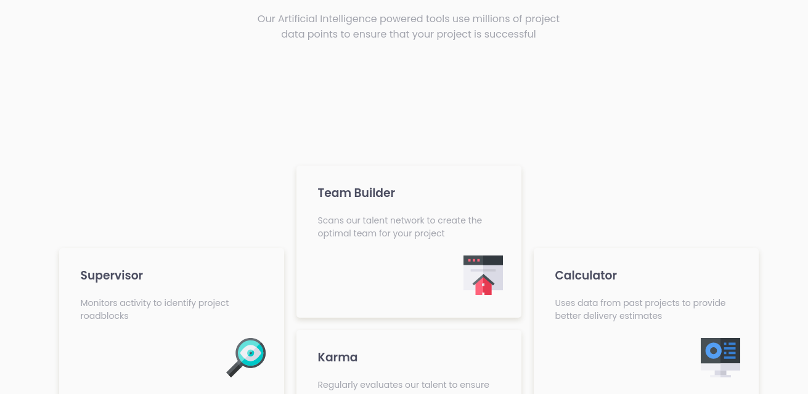

<h1 align="center">Four card feature section/h1>

   Solution for a challenge from  <a href="https://www.frontendmentor.io/challenges/four-card-feature-section-weK1eFYK" target="_blank">Frontend Mentor </a>.

  <h3>
    <a href="https://julioribc.github.io/Four-card-feacture-section-master-with-css-and-css-grid-/">
      Demo
    </a>
     | 
    <a href="https://github.com/Julioribc/Four-card-feacture-section-master-with-css-and-css-grid-">
      Solution
    </a>
     | 
    <a href="https://www.frontendmentor.io/challenges/four-card-feature-section-weK1eFYK">
      Challenge
    </a>
  </h3>

<!-- TABLE OF CONTENTS -->

## Table of Contents

- [Overview](#overview)
- [Built With](#built-with)
- [Contact](#contact)

<!-- OVERVIEW -->

## Overview

## Built With

- HTML
- CSS
- Bootstrap 5

## Contact

- GitHub [@Julioribc](https://github.com/Julioribc)
- Twitter [@Julioribc](https://twitter.com/Julioribc)
